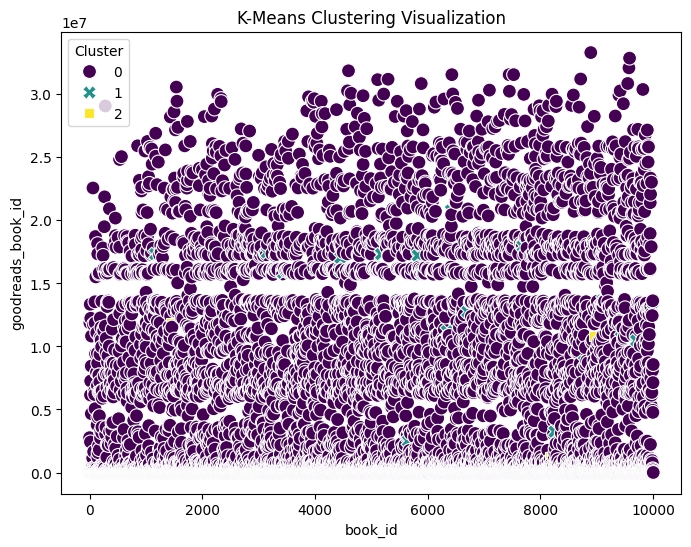
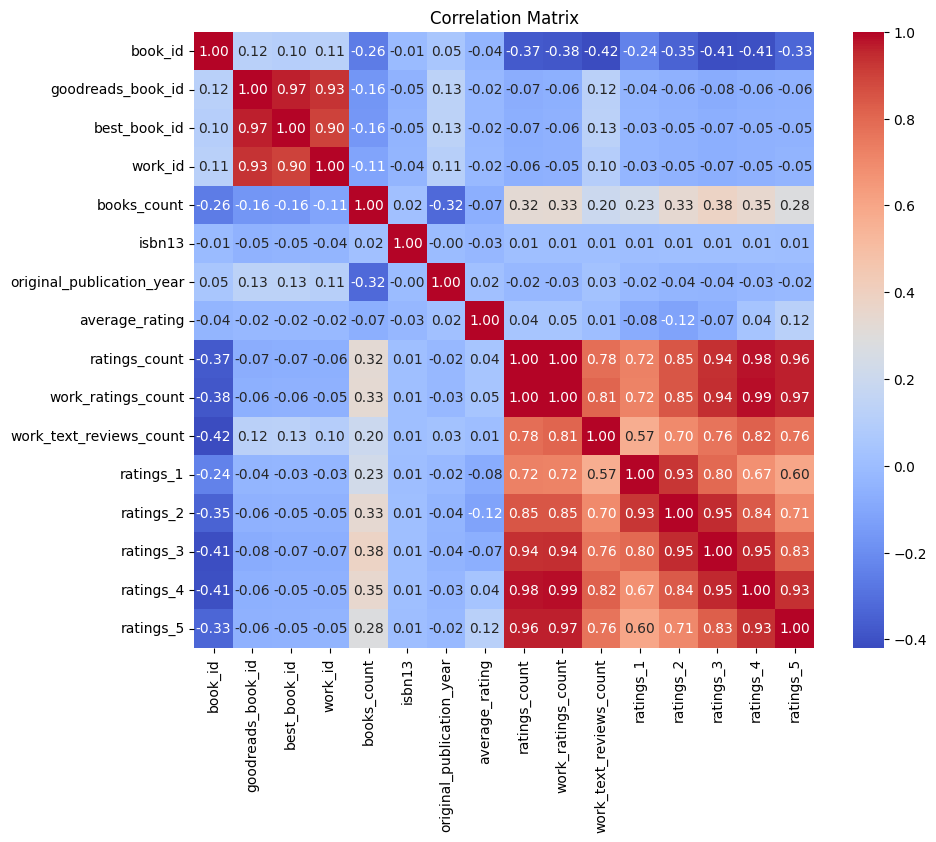

Here is a detailed and professional **README.md** file for your project:

---

# **Automated Dataset Analysis with K-Means Clustering and GPT Insights**

## **Overview**
This project automates the analysis, visualization, and storytelling of a given dataset using Python, K-Means clustering, and OpenAI's GPT-4o-mini model. The script dynamically analyzes any input CSV file, generates insightful narratives, visualizes patterns, and produces a well-documented Markdown report.

---

## **Features**
1. **Automated Data Loading**:
   - Handles different encodings (UTF-8, ISO-8859-1) for compatibility.

2. **Data Summary**:
   - Provides column names, data types, and general dataset statistics.

3. **Feature Analysis**:
   - Identifies important columns using GPT-4o-mini.
   - Differentiates between numeric and categorical features dynamically.

4. **K-Means Clustering**:
   - Performs clustering on numeric features.
   - Generates a scatterplot visualization for clustering results.
   - Summarizes cluster centers and statistics.

5. **Correlation Analysis**:
   - Generates a heatmap for correlations between numeric features.
   - Optionally produces a humorous correlation interpretation using GPT.

6. **Narrative Story Generation**:
   - Dynamically generates an engaging Markdown story summarizing:
     - Dataset structure
     - Insights about important features
     - Clustering results
     - Correlation analysis

7. **Markdown Output**:
   - Saves results as `README.md` with supporting visualizations:
     - `correlation_matrix.png`
     - `kmeans_clusters.png`

---

## **Dependencies**
The project requires Python **3.11+**. Install dependencies using the `uv` package manager or `pip`:
```bash
uv pip install pandas matplotlib seaborn requests scikit-learn tabulate python-dotenv
```

Alternatively, with pip:
```bash
pip install -r requirements.txt
```

---

## **Project Structure**
```plaintext
.
├── autolysis.py           # Main script for automated analysis
├── goodreads/             # Output folder for Goodreads dataset analysis
│   ├── README.md          # Story and insights for Goodreads dataset
│   ├── correlation_matrix.png
│   └── kmeans_clusters.png
├── happiness/             # Output folder for Happiness dataset analysis
│   ├── README.md          # Story and insights for Happiness dataset
│   ├── correlation_matrix.png
│   └── kmeans_clusters.png
├── media/                 # Placeholder for Media dataset output
├── goodreads.csv          # Sample dataset: Goodreads
├── happiness.csv          # Sample dataset: World Happiness
├── media.csv              # Sample dataset: Media Ratings
├── LICENSE                # MIT License
└── .env                   # Environment file for API Token
```

---

## **How to Run**
1. **Set up the `.env` file**:
   - Create a `.env` file in the project directory.
   - Add your API token as:
     ```plaintext
     AIPROXY_TOKEN=your_api_token_here
     ```

2. **Run the script**:
   Use the following command to run the script on any CSV file:
   ```bash
   uv run autolysis.py <path_to_csv>
   ```
   Example:
   ```bash
   uv run autolysis.py goodreads.csv
   ```

3. **Outputs**:
   - The script generates:
     - `README.md` containing the narrative and insights.
     - Visualizations: `kmeans_clusters.png`, `correlation_matrix.png`.

4. **View Results**:
   - Check the `README.md` and visualizations in the respective dataset folder.

---

## **Sample Outputs**
### **1. K-Means Clustering Visualization**
- Shows clustering on the top two numeric features.


### **2. Correlation Matrix**
- Heatmap showing relationships between numeric features.


---

## **Error Handling**
- Handles missing values using mean imputation.
- Ensures proper API token configuration.
- Provides fallback encoding for dataset loading.

---

## **License**
This project is licensed under the [MIT License](LICENSE).

---

## **How It Works**
1. **Data Loading**: Load the input CSV and handle missing values.
2. **Feature Inference**: Use GPT to infer feature types and identify key columns.
3. **K-Means Clustering**:
   - Perform clustering on numeric features.
   - Summarize clusters and generate scatterplot visualizations.
4. **Correlation Analysis**: Generate a heatmap and humorous insights.
5. **Narrative Generation**: Use GPT to craft a story combining all insights.
6. **Markdown Export**: Save outputs as `README.md`.

---

## **Contributors**
- **Rajat Goel**

