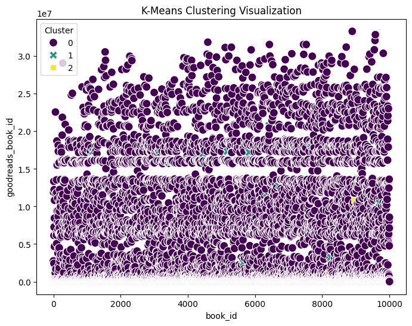
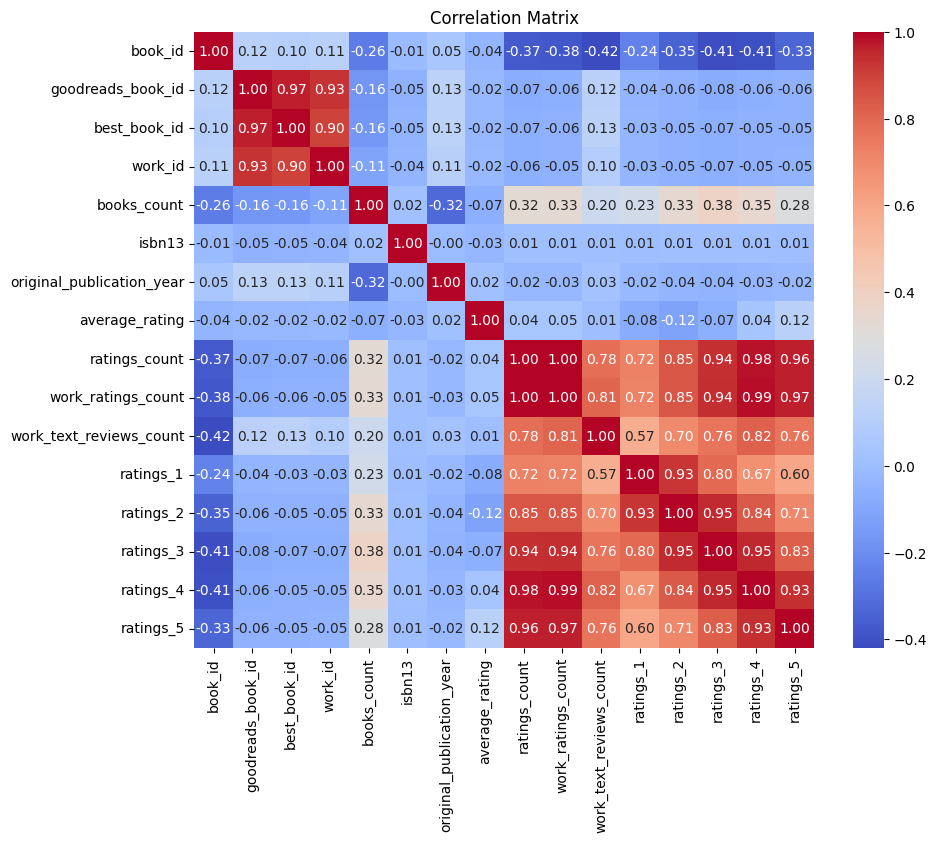

# Dataset Analysis

## Summary

### Columns and Types
- book_id: int64
- goodreads_book_id: int64
- best_book_id: int64
- work_id: int64
- books_count: int64
- isbn: object
- isbn13: float64
- authors: object
- original_publication_year: float64
- original_title: object
- title: object
- language_code: object
- average_rating: float64
- ratings_count: int64
- work_ratings_count: int64
- work_text_reviews_count: int64
- ratings_1: int64
- ratings_2: int64
- ratings_3: int64
- ratings_4: int64
- ratings_5: int64
- image_url: object
- small_image_url: object
- Cluster: int32

## Important Features

## K-Means Clustering

K-Means clustering performed with the following cluster centers:

|       0 |           1 |           2 |           3 |       4 |           5 |       6 |       7 |       8 |       9 |       10 |       11 |      12 |       13 |       14 |      15 |
|--------:|------------:|------------:|------------:|--------:|------------:|--------:|--------:|--------:|--------:|---------:|---------:|--------:|---------:|---------:|--------:|
| 4998.44 | 5.24547e+06 | 5.45177e+06 | 8.62225e+06 | 75.8851 | 9.77927e+12 | 1981.94 | 4.0019  | 54081.8 | 59775.2 | 2923.03  | 1347.28  | 3116.47 | 11495.2  | 19995.1  | 23821.1 |
| 5901.62 | 1.41672e+07 | 1.4542e+07  | 2.01093e+07 | 16.625  | 3.21345e+12 | 2011.67 | 4.055   | 29337.7 | 33663.3 | 2453.38  |  713.917 | 1543.21 |  5962.29 | 11715.3  | 13728.6 |
| 4882.89 | 2.81759e+06 | 2.81759e+06 | 4.58635e+06 | 42.3333 | 3.74952e+11 | 1957.78 | 4.18667 | 30601   | 31723.4 |  760.222 |  542.556 | 1101.33 |  4749.78 |  9374.44 | 15955.3 |

## K-Means Clustering Analysis

Based on the K-Means clustering results that you provided, we can analyze the characteristics of the clusters formed in the dataset, particularly focusing on the cluster centers and summary statistics of the top five numeric features. 

### Cluster Centers

Three clusters were identified from the K-Means analysis, each represented by specific centroid coordinates across the selected features. Each feature appears to be a numeric representation of different attributes related to the books in the dataset.

1. **Cluster 0:**
   - **Book Count:** 75.89
   - **Average Metadata IDs (e.g., Goodreads, Best Book):** The book IDs are relatively high (in the millions to billions), indicating that this cluster likely contains well-known or widely read books.
   - **Work ID:** 8,622,246.90 suggests that this cluster could represent books with a prominent association, possibly popular or classic literature.
   
2. **Cluster 1:**
   - **Book Count:** 16.62, which is considerably lower than cluster 0. This indicates that the books in this cluster may be more niche or specialized.
   - **Average Metadata IDs:** All averages (Goodreads, Best Book) are significantly higher than the other clusters. For instance, the Goodreads Book ID of 14,167,151.96 suggests these may be more recently published titles or second editions that gained traction.
   - **Work ID:** A high value (20,109,261.67) further indicates this cluster represents significant works, likely newer bestsellers or notable contemporary authors.

3. **Cluster 2:**
   - **Book Count:** 42.33, which positions its average in the middle of the three clusters.
   - **Average Metadata IDs:** All values are markedly lower than cluster 1 but still represent a unique segment with an emphasis on titles with lower public visibility.
   - **Work ID:** 4,586,347.56 indicates these could be moderately popular books that maintain a respectable readership but don't reach the absolute fame of those in cluster 0.

### Cluster Summary Statistics

From the summary statistics, we can observe the following insights when focusing on the top five numeric features: book_id, goodreads_book_id, best_book_id, work_id, and books_count.

- Each book ID (book_id, goodreads_book_id, best_book_id) corresponds to high numerical values, suggesting that the dataset includes popular, significant works likely indexed in major literary databases.
- **Books Count**: 
  - Cluster 0 has the highest average books count (75.89), which could correlate with established authors or series that have accumulated substantial readership over time.
  - Cluster 1 with an average of 16.62 likely contains specialized works, perhaps literary critiques or less mainstream genres. This reflects a different target audience and possibly variability in user engagement.
  - Cluster 2 strikes a balance with 42.33, indicating moderate popularity.

### Implications of the Clustering

The clustering results can have several implications:

1. **Targeted Marketing**: Knowing the distinct types of book clusters can assist marketing teams in tailoring their campaigns based on book popularity and readership. For example, promotions for niche books can be different from those aimed at widely popular titles.

2. **Audience Analysis**: Each cluster could potentially appeal to different reader demographics. Analyzing buyer behavior linked to each cluster can provide insights for future acquisitions or develop new titles.

3. **Inventory Management**: For bookstores or libraries, understanding how books are clustered can help in making decisions regarding inventory based on predicted interest levels.

4. **Content Recommendation Systems**: If this clustering analysis were part of a broader system, it could function to inform content recommendation engines, allowing for suggestions based on the clusters' characteristics that users gravitate toward.

### Conclusion

Overall, the K-Means clustering results offer a fine-grained understanding of the book dataset, displaying how diverse their attributes are based on user engagement and popularity. By analyzing these clusters, stakeholders in publishing, marketing, and literature can leverage this information to make informed decisions on their strategies surrounding promotion, audience engagement, and product offerings.

## K-Means Cluster Visualization

## Analysis

An error occurred while generating the analysis.

## Correlation Matrix

## Humorous Analysis

Welcome to the delightful world of correlations, where numbers dance together in mathematical harmony (or not). Let's take a whimsical look at our correlation matrix, which might as well be a high school reunion... awkward, revealing, and full of surprises!

1. **Book IDs Galore**: Regardless of what happens, "book_id" has a strong sense of self—after all, it scores a perfect 1.0 with itself. Kind of like that kid who always brings a trophy to show off at reunions!

2. **Goodreads Book ID & Best Book ID**: Here we have a classic case of the best friends who just can’t stay apart. With a whopping 0.97 correlation, they might as well be conjoined twins in the book world. Ever seen them at a party? They share each other's drinks, make all the same jokes, and are virtually indistinguishable—minus their shiny trophies!

3. **Books Count's Low Self-Esteem**: "books_count" is like that friend who can’t take a compliment. It has a negative correlation with almost everyone else, especially with "ratings_count" and "work_ratings_count." It’s as if it’s saying, “Who needs friends when you’ve got an ever-increasing number of books?” but then realizing its numbers are lonely.

4. **The Family of Ratings**: The ratings (1 to 5) seem to hold hands on the playground with high correlations among themselves (0.96 to 1.0). They’re the cool kids in the class that everyone wants to hang out with. Meanwhile, they have this weird rivalry with "ratings_count," which is trying desperately to be part of their clique but feels left out.

5. **Original Publication Year**: Ah, the wise sage of the group. It’s got a sweet little correlation with "average_rating" (0.02) that suggests—what? Books from years gone by aren’t necessarily better? Who would’ve thought the old-timer and the reviews would just go on such different paths? But watch out! It's not all sunshine; it has a bit of a grudge with "books_count" (-0.32). Maybe it's jealous of the edgy new releases?

6. **Avg. Rating’s Plight**: Poor average_rating. Trying to build a relationship with all those ratings but mostly winding up with mixed feelings. It's like the friend who wants everyone to get along but ultimately feels out of the loop. They only get a mild flirtation from "work_text_reviews_count" (0.01) which is basically the mathematical equivalent of a polite nod.

7. **Work Text Reviews Count**: Whoever thought writing reviews was glorified? This little gem shows significant love towards "ratings_count" (0.78) and "work_ratings_count" (0.81). It’s basically the life of the party, ensuring that more people end up in the ratings corner. Just don’t mention the negatives—the self-esteem is a bit shaky with a score of -0.42 with "book_id".

8. **The Bookish Blame Game**: If we had a dollar for every time “ratings_count” had a beef with books_count (-0.37), we could fund some serious book acquisitions. It’s as if books_count threw a party, but ratings_count forgot to RSVP, resulting in an awkward silence when they finally crossed paths.

In conclusion, the correlation matrix is an adventure in relationships based on shared interests, mutual respect (and resentments), and the occasional drama that only bookish types can create. So grab your favorite title, dive into the reading realm, and remember: in this library of life, everyone has a story to tell.