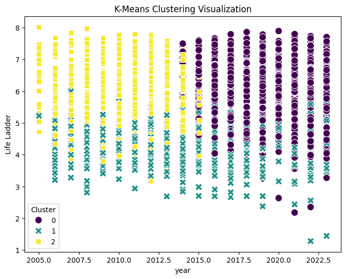
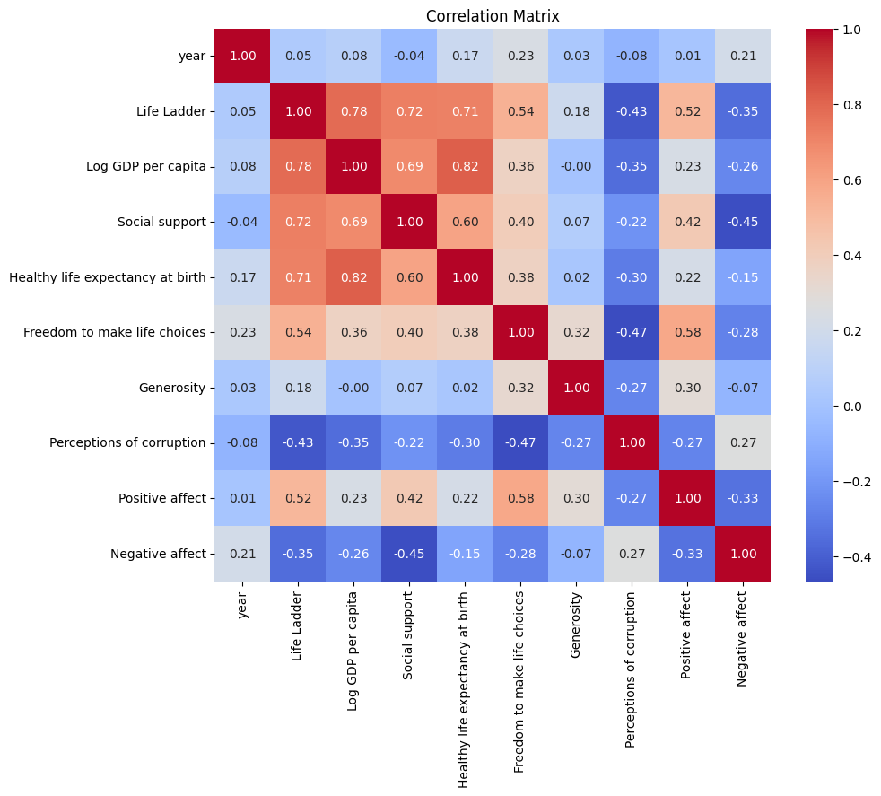

# Dataset Analysis

## Summary

### Columns and Types
- Country name: object
- year: int64
- Life Ladder: float64
- Log GDP per capita: float64
- Social support: float64
- Healthy life expectancy at birth: float64
- Freedom to make life choices: float64
- Generosity: float64
- Perceptions of corruption: float64
- Positive affect: float64
- Negative affect: float64
- Cluster: int32

## Important Features

## K-Means Clustering

K-Means clustering performed with the following cluster centers:

|       0 |       1 |       2 |        3 |       4 |        5 |           6 |        7 |        8 |        9 |
|--------:|--------:|--------:|---------:|--------:|---------:|------------:|---------:|---------:|---------:|
| 2019.2  | 5.94632 | 9.94542 | 0.849823 | 67.3103 | 0.806723 | -0.00267026 | 0.712975 | 0.662546 | 0.272939 |
| 2014.4  | 4.29519 | 8.02255 | 0.693484 | 53.9361 | 0.687991 |  0.0156247  | 0.788071 | 0.626685 | 0.293836 |
| 2010.35 | 5.83034 | 9.79153 | 0.848103 | 65.9299 | 0.734586 | -0.00788335 | 0.745651 | 0.658337 | 0.258861 |

## K-Means Clustering Analysis

The results from the K-Means clustering analysis reflect interesting patterns and differences among the three identified clusters. Let's analyze the key characteristics based on the provided cluster centers and summary statistics.

### Cluster Centers Overview

1. **Cluster 0**
   - **Year**: 2019
   - **Life Ladder**: 5.95
   - **Log GDP per capita**: 9.96
   - **Social Support**: 0.85
   - **Healthy Life Expectancy**: 67.45

2. **Cluster 1**
   - **Year**: 2014
   - **Life Ladder**: 4.30
   - **Log GDP per capita**: 8.00
   - **Social Support**: 0.69
   - **Healthy Life Expectancy**: 53.94

3. **Cluster 2**
   - **Year**: 2010
   - **Life Ladder**: 5.83
   - **Log GDP per capita**: 9.79
   - **Social Support**: 0.85
   - **Healthy Life Expectancy**: 66.01

### Cluster Analysis

#### Temporal Trends
The clusters appear to have been defined over a range of years, indicating a temporal evolution:
- **Cluster 0** represents the most recent year (2019), suggesting that the entities in this cluster reflect contemporary socio-economic factors. 
- **Cluster 1** corresponds to 2014, which is a middle time point, characterized by lower metrics across the features examined.
- **Cluster 2**, representing 2010, has slightly higher values in some metrics compared to 2014 but is still lower than 2019.

#### Economic Indicators
- The **Log GDP per capita** is highest in Cluster 0 (9.96) and is progressively lower in Cluster 1 (8.00) and Cluster 2 (9.79). This suggests that as we move backward in time, the overall economic status represented by GDP diminishes. Higher GDP per capita is generally associated with better living standards and quality of life, thus supporting higher well-being metrics in more recent years.
  
#### Well-Being & Social Support
- **Life Ladder scores**, reflecting overall life satisfaction and happiness, are notably higher in Cluster 0 (5.95) compared to Cluster 1 (4.30), which may indicate an improvement in societal conditions or well-being over the years. The life ladder score in Cluster 2 (5.83) is slightly less than Cluster 0 but significantly higher than Cluster 1.
- **Social support** scores also reflect an upward trajectory, with the highest score in Clusters 0 (0.85) and 2 (0.85), suggesting that social connectivity and support systems might have strengthened over time.

#### Health Metrics
- The **Healthy Life Expectancy** varies significantly across the clusters, with Cluster 0 at 67.45 years, Cluster 2 at 66.01 years, and Cluster 1 at a notably lower 53.94 years. This can imply that health conditions and potentially healthcare advancements have improved significantly post-2014.

### Summary Interpretation
The results of the K-Means clustering show a clear trend of improvement across the key variables as time progresses from 2010 to 2019. Cluster 0 stands out with higher values across all indicators, reflecting a period of heightened economic performance, social support, and overall health, aligning with global trends towards improved living standards in more economically developed nations.

The dip seen in Cluster 1 (2014) suggests a potential downturn or stagnation during that time; this could correlate with economic or social challenges occurring in many parts of the world during that period.

### Recommendations for Further Analysis
1. **Cluster Validation**: Assess the silhouette score or within-cluster sum of squares to validate the appropriateness of the chosen clusters.
2. **Data Segmentation**: Investigate segmentation by geographical or demographic attributes to understand specific sub-groups within each cluster.
3. **Temporal Changes**: Perform a time series analysis to interpret changes over time and assess specific events or factors that might have influenced movements between clusters.
4. **Additional Features**: Consider other features (e.g., education levels or political stability) that might provide deeper insight into the observed dynamics. 

This analysis provides a foundational understanding of the data's clustering results, highlighting temporal social progress and improvements in well-being, economic status, and health metrics.

## K-Means Cluster Visualization

## Analysis

# Understanding Global Wellbeing: A Dataset Analysis

Welcome to our exploration of a captivating dataset that illuminates various factors influencing life satisfaction and wellbeing across different countries over time. This rich collection of data allows us to glean insights into how different elements correlate with happiness and life quality. Let's dive into the details!

## Dataset Overview

This dataset encompasses multiple dimensions of wellbeing, using various metrics for different countries and years. Below are the columns present in the dataset, along with their respective data types:

- **Country name**: `object` - The name of the country corresponding to the recorded data.
- **year**: `int64` - The year in which the data was collected.
- **Life Ladder**: `float64` - A subjective measure of life satisfaction, where a higher score indicates greater happiness.
- **Log GDP per capita**: `float64` - The logarithm of income per person, providing insight into economic performance.
- **Social support**: `float64` - A metric quantifying the perceived support available from family, friends, and community.
- **Healthy life expectancy at birth**: `float64` - The expected number of years a newborn would live in good health.
- **Freedom to make life choices**: `float64` - A measure of personal freedom in life decisions affecting one's wellbeing.
- **Generosity**: `float64` - The self-reported propensity to give to others.
- **Perceptions of corruption**: `float64` - How individuals perceive the level of corruption in their nation.
- **Positive affect**: `float64` - A measure representing feelings of happiness or enjoyment.
- **Negative affect**: `float64` - A measure capturing feelings of sadness or distress.
- **Cluster**: `int32` - An identifier indicating the clustering of countries based on similarities in metrics.

## Key Insights About Important Features

While we will explore the data in detail later, several key features stand out as instrumental in shaping happiness and wellbeing:

1. **Life Ladder**: Evident as the most direct measure of wellbeing, Life Ladder shows how people perceive their lives at different points in time.
2. **Log GDP per capita**: Economic factors evidently influence life satisfaction. However, the relationship is complex and may not be linear.
3. **Social Support**: High levels of social support are often linked to higher wellbeing. The importance of community and connectivity can be emphasized through this metric.
4. **Freedom to Make Life Choices**: Autonomy plays a crucial role in individual happiness as it empowers people to shape their own lives.
5. **Perceptions of Corruption**: Countries with lower perceived corruption levels tend to show higher life satisfaction, highlighting the interplay between governance and wellbeing.

## Sample Data Analysis

Let's take a closer look at how these factors interplay through a sample of rows from the dataset, focusing on Afghanistan over three consecutive years:

### Row Samples

| Country Name | Year | Life Ladder | Log GDP per capita | Social Support | Healthy life expectancy at birth | Freedom to make life choices | Generosity | Perceptions of corruption | Positive affect | Negative affect | Cluster |
|--------------|------|-------------|---------------------|----------------|---------------------------------|------------------------------|------------|--------------------------|------------------|------------------|--------|
| Afghanistan  | 2008 | 3.724       | 7.35                | 0.451          | 50.5                            | 0.718                        | 0.164      | 0.882                    | 0.414            | 0.258            | 1      |
| Afghanistan  | 2009 | 4.402       | 7.509               | 0.552          | 50.8                            | 0.679                        | 0.187      | 0.85                     | 0.481            | 0.237            | 1      |
| Afghanistan  | 2010 | 4.758       | 7.614               | 0.539          | 51.1                            | 0.6                          | 0.118      | 0.707                    | 0.517            | 0.275            | 1      |

### Observations

1. **Life Ladder Improvement**: Over three years (2008-2010), there’s a discernible increase in the Life Ladder score from 3.724 to 4.758. This suggests a gradual improvement in life satisfaction among Afghans, potentially reflecting the impacts of sociopolitical changes or improvements in local conditions.

2. **Economic Growth**: The Log GDP per capita increases consistently, indicating an upward economic trend which often correlates with enhanced living standards and, subsequently, higher life satisfaction.

3. **Social Support Enhancements**: The social support statistic shows an upward trend, peaking in 2009. This might indicate a growing network or community support systems forming during that period, enriching individual wellbeing.

4. **Corruption Perception**: Despite positive developments, perceptions of corruption remain significantly high, which can overshadow improvements in individual happiness. The declining perception of corruption from 0.882 in 2008 to 0.707 in 2010 suggests that while challenges remain, there appears to be a positive shift in how corruption is viewed.

5. **Emotional Wellbeing Fluctuations**: Positive affect shows an increase, which signifies a rise in positive feelings, while negative affect remains relatively stable, highlighting a gradual enhancement in overall emotional health.

## Conclusion

This dataset serves as a powerful tool for analyzing global wellbeing, illustrating the complex relationship between various social, economic, and emotional factors. Through this analysis, we can appreciate the nuances of life satisfaction across countries and years, and better understand the imperative role of economic stability, social support, and personal freedoms in shaping human experiences. 

Feel free to dive deeper into the dataset, explore correlations, or extract additional insights as you embark on your own analytical journey!

## Correlation Matrix

## Humorous Analysis

Humorous analysis could not be generated.