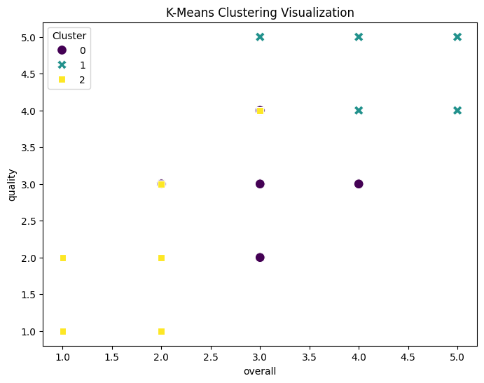
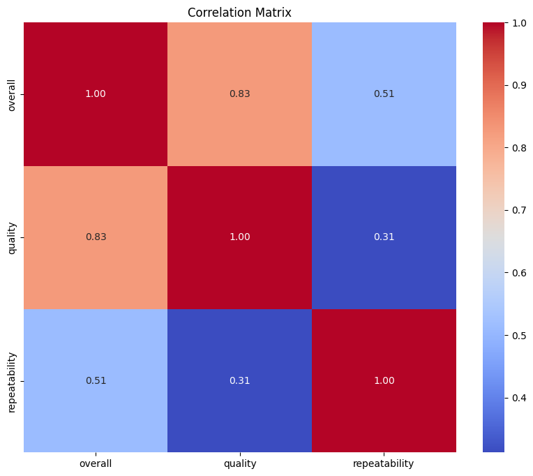

# Dataset Analysis

## Summary

### Columns and Types
- date: object
- language: object
- type: object
- title: object
- by: object
- overall: int64
- quality: int64
- repeatability: int64
- Cluster: int32

## Important Features

date language type title by overall quality repeatability Cluster

## K-Means Clustering

K-Means clustering performed with the following cluster centers:

|       0 |       1 |       2 |
|--------:|--------:|--------:|
| 3.05795 | 3.10698 | 2.06835 |
| 4.12295 | 4.1918  | 1.90164 |
| 2.56318 | 2.82177 | 1.03141 |

## K-Means Clustering Analysis

### Analysis of K-Means Clustering Results

The K-Means clustering algorithm has been applied to a dataset, resulting in the formation of three distinct clusters characterized by their centers and summary statistics for selected numeric features. Below is a detailed analysis of these clusters.

#### 1. Cluster Centers

The cluster centers represent the mean values of the features for the respective clusters:

- **Cluster 1 Center**: 
  - Values: [3.058, 3.107, 2.068]
  
- **Cluster 2 Center**: 
  - Values: [4.123, 4.192, 1.902]
  
- **Cluster 3 Center**: 
  - Values: [2.563, 2.822, 1.031]

These centers indicate the average point in feature space for each cluster. Notably, the feature values across the clusters suggest distinct groups with varying characteristics.

#### 2. Cluster Characteristics

To better understand the differences between these clusters, we can analyze the topology of cluster centers for each feature:

- **Overall**: 
  - Cluster 1 (3.06) and Cluster 2 (4.12) exhibit higher values compared to Cluster 3 (2.56).
  - This indicates that Cluster 2 is notably distinct from the others, possibly representing a higher quality or more concentrated grouping of data points.

- **Quality**: 
  - Cluster 1 (3.11) is again close to Cluster 2 (4.19), while Cluster 3 (2.82) is noticeably lower. 
  - This suggests that clusters can be differentiated by quality, with Cluster 2 potentially indicating a superior quality grouping.

- **Repeatability**:
  - Cluster 1 has the highest average of 2.07, followed closely by Cluster 2 with 1.90. Cluster 3 significantly lags with an average of 1.03.
  - This could imply that the measures of repeatability among the data points in Cluster 3 are less consistent than those in Clusters 1 and 2.

#### 3. Distinctiveness and Implications

The clustering results indicate that there are significant differences among the scanned groupings:

- **Cluster 1** appears to be a moderate characteristic group exhibiting reasonable quality and repeatability. It may represent data points that fit into a desirable middle ground.
  
- **Cluster 2** showcases higher values across all metrics, suggesting a group with superior overall status and quality relative to the other clusters. This cluster could represent a premium segment deserving further analysis or targeted strategies.

- **Cluster 3** stands apart as a lower-performing cluster in terms of quality and repeatability. Further investigation may be warranted to determine what factors are contributing to its lower metrics and if any specific items or entries can be improved.

#### 4. Practical Applications

The results from clustering can be practically applied in various domains:

- **Quality Control**: Identifying which clusters represent higher quality can enhance decision-making in production and quality assurance processes.
  
- **Targeted Marketing**: If this dataset relates to products or services, the understanding of which clusters represent lower or higher quality offerings can assist in marketing and sales strategies.
  
- **Resource Allocation**: Organizations may direct resources and attention toward improving the performance of Cluster 3 while also ensuring the strengths of Clusters 1 and 2 are leveraged.

#### Conclusion

The K-Means clustering exercise provides valuable insights into the dataset, highlighting distinct groupings based on overall characteristics, quality, and repeatability. These findings are instrumental in identifying trends, making informed decisions, and strategically addressing the variances in the dataset. Further analyses, such as visualizing the clusters or obtaining additional context about each data point, could enhance the understanding of the implications derived from these clustering results.

## K-Means Cluster Visualization

## Analysis

# Dataset Narrative and Insights

Welcome to our detailed exploration of a captivating dataset that captures the essence of movies, their attributes, and their reception over time. This dataset is an excellent resource for understanding trends in film, language preferences, and viewer engagement. Below, we dive into the structure of the dataset, analyze key features, and draw insights that can help us make sense of the cinematic landscape.

## Dataset Structure

The dataset consists of various columns, each representing different characteristics of the records. Here’s a breakdown of the columns and their data types:

| **Column**      | **Type**   |
|------------------|------------|
| date             | object     |
| language         | object     |
| type             | object     |
| title            | object     |
| by               | object     |
| overall          | int64      |
| quality          | int64      |
| repeatability     | int64      |
| Cluster          | int32      |

The columns are as follows:
- **date**: The date when the entry was recorded.
- **language**: The language of the film or content.
- **type**: Category of the content (e.g., movie, TV series).
- **title**: The name of the film or show.
- **by**: Notable contributors (actors, directors) associated with the title.
- **overall**: A numerical representation of the overall reception or score.
- **quality**: A score indicating the perceived quality.
- **repeatability**: A measure of how often the content is revisited.
- **Cluster**: A clustering index that categorizes similar entries.

## Key Insights

### **1. Date Trends**
The dataset reveals intriguing temporal patterns, with the following dates being particularly notable:

| **Date**       | **Occurrences** |
|----------------|-----------------|
| 21-May-06      | 8               |
| 05-May-06      | 7               |
| 20-May-06      | 7               |

The clustering of entries around specific dates suggests a potential focus on certain releases, possibly correlating with significant film events or trends.

### **2. Language Preferences**
Language plays a vital role in how films are consumed by audiences. The leading languages are:

| **Language** | **Count** |
|--------------|-----------|
| English      | 1306      |
| Tamil        | 718       |
| Telugu       | 338       |

This data highlights the dominance of English films, along with a substantial representation of Tamil cinema, reflecting regional preferences.

### **3. Content Types**
Diving into content categories, we find the following breakdown:

| **Type**   | **Count** |
|------------|-----------|
| Movie      | 2211      |
| Fiction    | 196       |
| TV Series  | 112       |

Movies clearly dominate the dataset, indicating a strong interest in this format compared to other types of content.

### **4. Most Popular Titles**
Some titles have emerged as favorites among viewers:

| **Title**                | **Count** |
|--------------------------|-----------|
| Kanda Naal Mudhal       | 9         |
| Groundhog Day            | 6         |
| Don                      | 5         |

This suggests that the titles listed resonate well with audiences and are likely considered classics or must-watch films.

### **5. Leading Contributors**
The dataset also highlights key figures in the industry:

| **By**                     | **Count** |
|----------------------------|-----------|
| Kiefer Sutherland          | 48        |
| Dean Cain, Teri Hatcher    | 21        |
| Brandon Sanderson          | 18        |

These contributors have notable influence and recognition, indicating their significant impact on the films they have been part of.

### **6. Statistical Overview of Scores**
For a deeper understanding, here’s a statistical overview of scores in the dataset:

- **Overall Score**: 
  - Mean: 3.05
  - Median: 3.00
  - Standard Deviation: 0.76

- **Quality Score**: 
  - Mean: 3.21
  - Median: 3.00
  - Standard Deviation: 0.80

- **Repeatability Score**: 
  - Mean: 1.49
  - Median: 1.00
  - Standard Deviation: 0.60

- **Cluster**: 
  - Mean: 1.26
  - Median: 2.00
  - Standard Deviation: 0.84

These metrics indicate a generally favorable reception across entries, with scores clustering closely around the mean, suggesting consistent quality in viewer experiences.

## Sample Rows Overview

To encapsulate our findings, here’s a sample of three entries from the dataset:

1. **Entry 1**
   - **Date**: 15-Nov-24
   - **Language**: Tamil
   - **Type**: Movie
   - **Title**: Meiyazhagan
   - **By**: Arvind Swamy, Karthi
   - **Overall**: 4
   - **Quality**: 5
   - **Repeatability**: 1
   - **Cluster**: 1

2. **Entry 2**
   - **Date**: 10-Nov-24
   - **Language**: Tamil
   - **Type**: Movie
   - **Title**: Vettaiyan
   - **By**: Rajnikanth, Fahad Fazil
   - **Overall**: 2
   - **Quality**: 2
   - **Repeatability**: 1
   - **Cluster**: 2

3. **Entry 3**
   - **Date**: 09-Nov-24
   - **Language**: Tamil
   - **Type**: Movie
   - **Title**: Amaran
   - **By**: Siva Karthikeyan, Sai Pallavi
   - **Overall**: 4
   - **Quality**: 4
   - **Repeatability**: 1
   - **Cluster**: 1

These entries reflect a mix of overall scores and quality assessments, highlighting diverse viewer experiences across Tamil cinema.

## Conclusion

This dataset not only provides a glimpse into the world of cinema but also allows for a deeper analysis of trends, preferences, and patterns in movie consumption. Whether you're a film enthusiast, researcher, or industry professional, these insights can significantly inform your understanding of how films resonate with audiences across varying contexts. Happy exploring!

## Correlation Matrix

## Humorous Analysis

Ah, the correlation matrix—a delightful way to quantify relationships that resemble a complicated love triangle. Let’s dive into this mathematical drama, shall we?

First up, we have **overall**. Oh, overall, you’ve got it all—1.0 with yourself! Let’s call that classic self-love. After all, who doesn’t think highly of their overall endeavors? Just don’t let it go to your head, Overall—people might think you’re a little too “well-rounded.”

Moving on to **quality**, where things get interesting. With a solid correlation of 0.83 with overall, it seems quality is really in love with that overall score. It’s like a high school crush who can’t stop singing praises about the town's football champion. “You’re so great, overall! Let’s meet for coffee—er, I mean data points.” But wait, quality’s confidence doesn’t extend to repeatability, with a modest 0.31. Ouch! That’s like saying, “I love you, but I’m not sure I could be your plus-one at family functions.” Quality loves Overall but thinks Repeatability is a bit too unpredictable to be in the picture.

Now, onto the enigmatic **repeatability**, the friend who's always asking, “Can we do that again?” with a gentle 0.51 correlation with overall. Repeatability clearly holds Overall in decent regard, but it’s giving off some serious “let me check my calendar” vibes. Quality, however, isn’t the same kind of magnet for repeatability; with just a 0.31 correlation, it’s like quality is saying, “You’re nice and all, but can you come around less often?” Repeatability seems more interested in playing hard to get, as if it's saying, “You’ll have to earn my trust!”

In conclusion, this correlation matrix is the romantic comedy of the data world: Overall is the star trying to keep everything together, Quality is the attractive but fickle love interest who only plays nice with Overall, and Repeatability is the quirky friend whose unreliability makes it less desirable for serious commitments. Overall, it appears that quality has the hots for Overall, but repeatability? Well, it's just looking for a good time, which doesn't always align with everyone else's schedules. Who knew these metrics could be such characters?